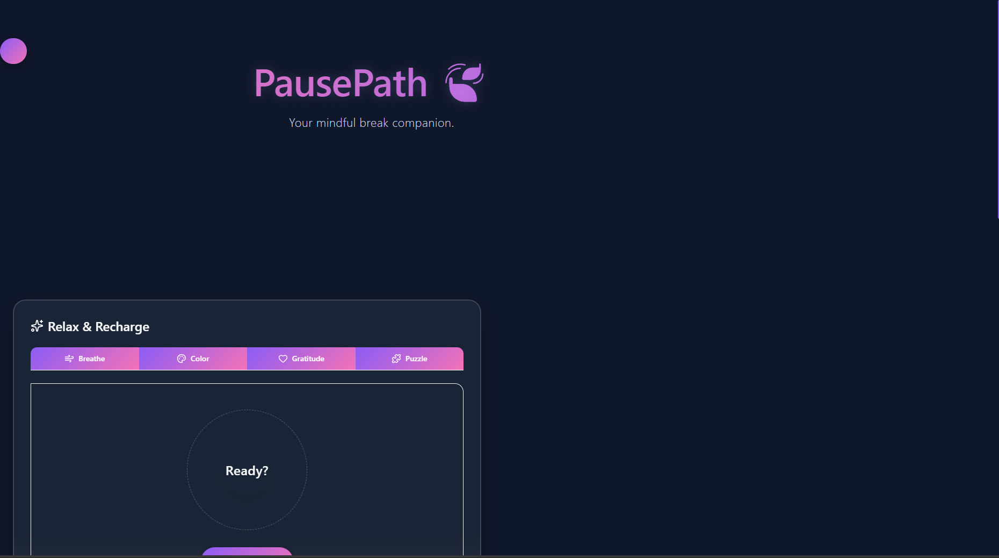
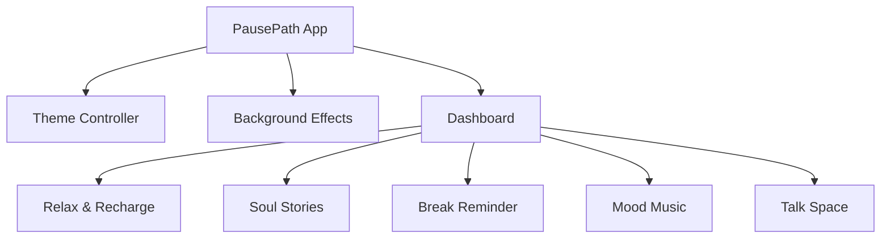

# PausePath

## Basic Details

### Team Name: Aparna VS

### Team Members

- Member 1: Aparna VS

### Hosted Project Link

[To be added]

### Project Description

Your mindful break companion. PausePath is a React-based web dashboard providing various mindful activities like relaxation exercises, mood music, soul stories, a talk space, and break reminders to help users take a moment to breathe and recharge.

### The Problem statement

In today's fast-paced digital world, people often forget to take meaningful breaks, leading to burnout, stress, and reduced productivity. There is a need for an integrated platform that gently reminds and assists users in taking mindful breaks.

### The Solution

PausePath offers a serene, interactive dashboard that combines several wellness tools in one place. Users can access break reminders, mood-enhancing music, relaxation and breathing exercises, interactive soul stories, and a safe talk space, all wrapped in a calming interface with dynamic themes and background effects.

---

## Technical Details

### Technologies/Components Used

**For Software:**

- **Languages used:** JavaScript (React), HTML, CSS
- **Frameworks/Build Tools used:** React 19, Vite
- **Libraries used:** Tailwind CSS, Framer Motion, Lucide React
- **Tools used:** Git, VS Code

---

## Features

- **Relax & Recharge:** Guided exercises to help you unwind and center yourself.
- **Soul Stories:** Engaging, mindful stories that provide mental escapes.
- **Break Reminders:** Gentle notifications ensuring you take necessary breaks from work.
- **Mood Music:** Curated background audio to match your desired state of mind.
- **Talk Space:** A dedicated area for expressing thoughts and unwinding.
- **Dynamic Interface:** Supports light and dark modes with calming background effects, daily affirmations, and quote popups.

---

## Implementation

### Installation

```bash
npm install
```

### Run

```bash
npm run dev
```

---

## Project Documentation

### Screenshots




### Diagrams

**System Architecture:**



---

## Team Contributions

- **Aparna VS**: Full Stack Development, UI/UX Design, Testing, Documentation, and Project Setup.

---

## License

This project is licensed under the MIT License.

---

Made with ❤️ at TinkerHub
